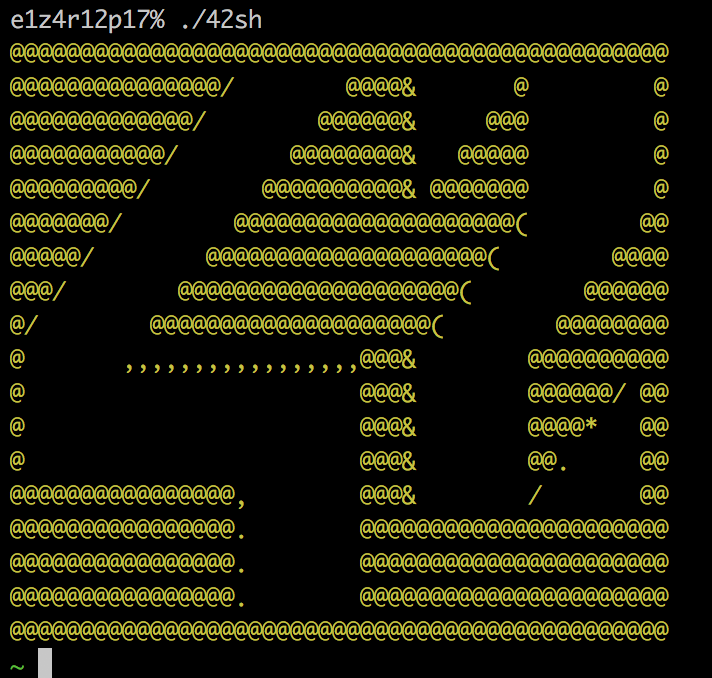
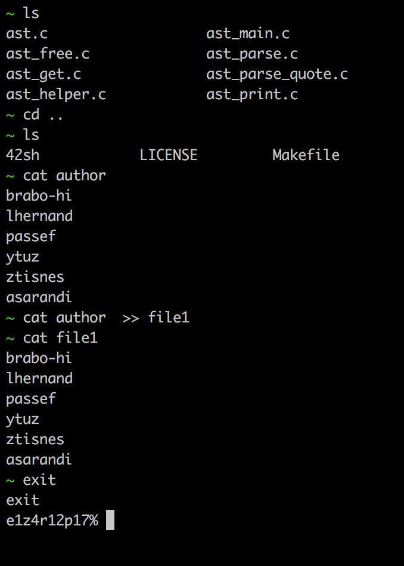

# 42_Shell

This project is about writing the most stable and most complete UNIX shell 
possible.

### Compiling Program
The 42_Shell program wil compile into the executable ```42sh``` after 
having cloned this repository into the desired location and running the
command **make** inside the cloned repository.

```
cd ~/Desktop &&
git clone https://github.com/amnotme/42_Shell.git &&
cd 42_Shell &&
make
```
### Standard features of the custom shell program (42sh)

The 42sh will function similiarly to a regular shell / terminal.  The shell
program will be able to have the following basic features:

A minimum line acquisition:

- [x] Prompt display.
- [x] Reading of a command line without line edition.
- [x] Proper space and tabulations management.

The following builtins including all their features if they have any 
(the strict minimum being the features listed in POSIX standard):

- [x] cd
- [x] echo
- [x] exit
- [x] env
- [x] setenv
- [x] unsetenv

- [x] Simple execution of simple command with arguments and PATH management.
- [x] Error and command’s return value management.
- [x] The following redirections: ">", ">>", "<" and "|".
- [x] The following logical operators "&&" and "||".
- [x] The ";" separator.

### In use

Start of shell program:



Execution of duplicated UNIX commands:


